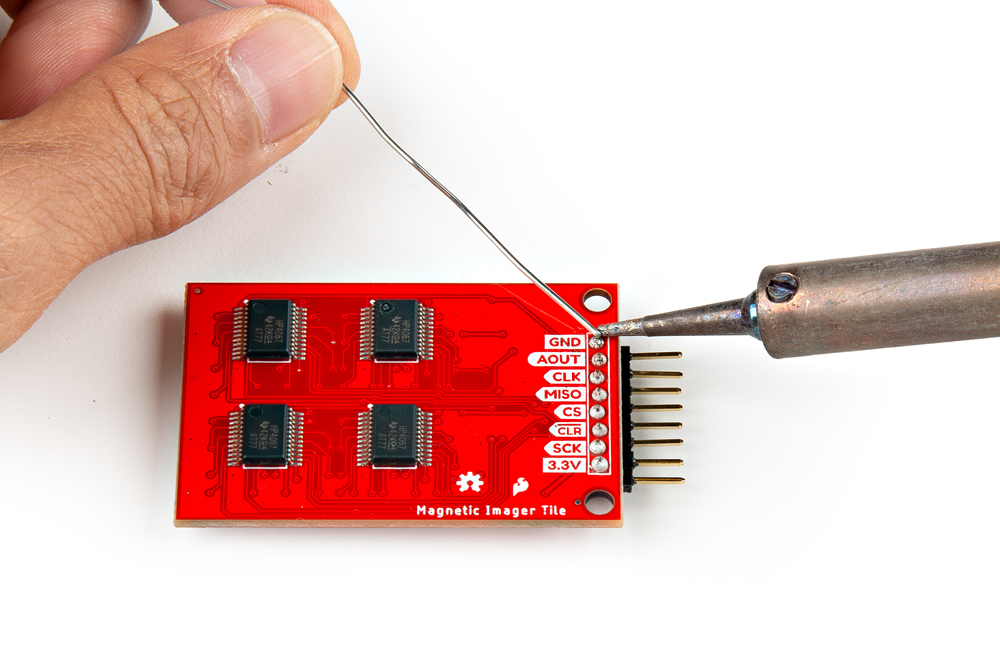
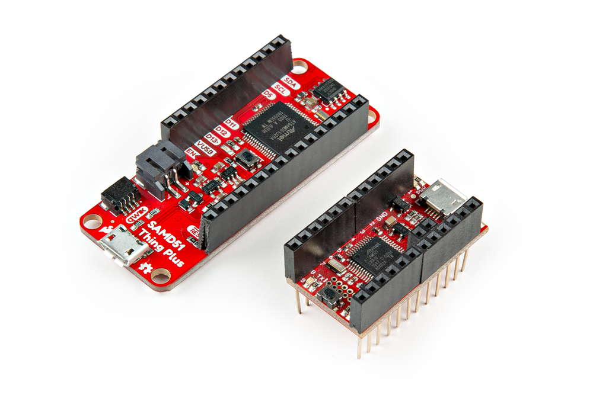
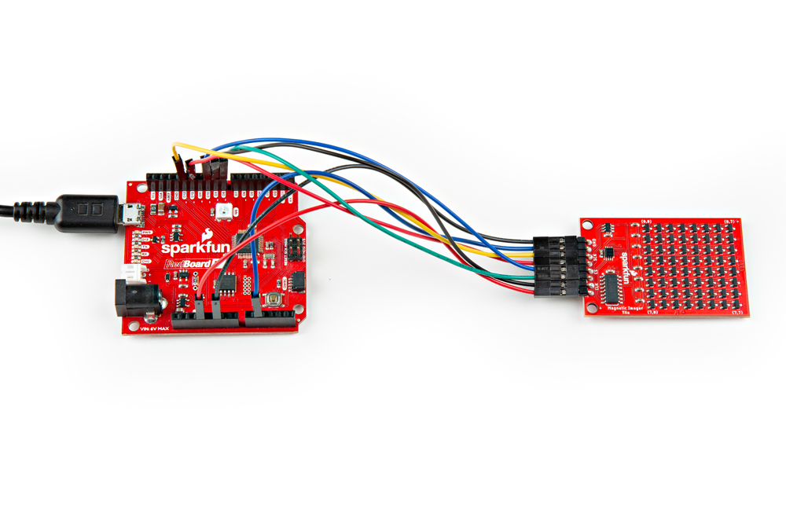
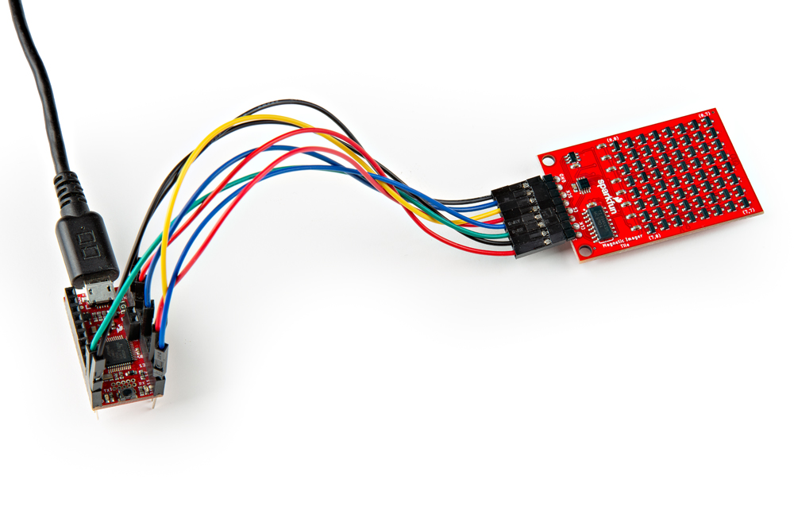

### Connecting via PTH

For temporary connections to the PTHs, you could use IC hooks to test out the pins. However, you'll need to solder headers or wires of your choice to the board for a secure connection. You can choose between a combination of [header pins and jumper wires](https://learn.sparkfun.com/tutorials/how-to-solder-through-hole-soldering/all), or [stripping wire and soldering the wire](https://learn.sparkfun.com/tutorials/working-with-wire/all) directly to the board.

-   <a href="https://learn.sparkfun.com/tutorials/how-to-solder-through-hole-soldering/all">
      <figure markdown>
        
      </figure>
    </a>

    ---

    <a href="https://learn.sparkfun.com/tutorials/how-to-solder-through-hole-soldering/all">
      <b>How to Solder: Through Hole Soldering</b>
    </a>
<!-- ----------WHITE SPACE BETWEEN GRID CARDS---------- -->

-   <a href="https://learn.sparkfun.com/tutorials/working-with-wire/all">
      <figure markdown>
        
      </figure>
    </a>

    ---

    <a href="https://learn.sparkfun.com/tutorials/working-with-wire/all">
      <b>Working with Wire</b>
    </a>
<!-- ----------WHITE SPACE BETWEEN GRID CARDS---------- -->

For the scope of this tutorial, we will use right angle, male headers. Insert the right angle headers on the top side and solder the header pins from the bottom. Of course, you can also insert the right angle header so that the pins face toward the multiplexors similar to Peter's demo video.

  <table>
    <tr style="vertical-align:middle;">
     <td style="text-align: center; vertical-align: middle; border: solid 1px #cccccc;"></td>
    </tr>
    <tr style="vertical-align:middle;">
     <td style="text-align: center; vertical-align: middle; border: solid 1px #cccccc;"><i>Headers Being Soldered to the Magnetic Imaging Tile</i></td>
    </tr>
  </table>

    <table>
        <tr>
            <th style="text-align: center; border: solid 1px #cccccc;">Magnetic Imaging Tile Pinout
            </th>
            <th style="text-align: center; border: solid 1px #cccccc;"> SAMD21 Pinout (i.e. RedBoard Turbo, SAMD21 Mini, etc.)
            </th>
            <th style="text-align: center; border: solid 1px #cccccc;"> Teensy Pinout (i.e. Teensy v3.1, v3.5, v4.0, v4.1, etc.)
            </th>
            <th style="text-align: center; border: solid 1px #cccccc;"> SAMD51 Pinout (i.e. SAMD51 Thing Plus, etc.)
            </th>
        </tr>
        <tr>
            <td style="text-align: center; border: solid 1px #cccccc;" bgcolor="#DDDDDD">GND
            </td>
            <td style="text-align: center; border: solid 1px #cccccc;" bgcolor="#DDDDDD">GND
            </td>
            <td style="text-align: center; border: solid 1px #cccccc;" bgcolor="#DDDDDD">GND
            </td>
            <td style="text-align: center; border: solid 1px #cccccc;" bgcolor="#DDDDDD">GND
            </td>
        </tr>
        <tr>        
            <td style="text-align: center; border: solid 1px #cccccc;" bgcolor="#cce5ff">OUT
            </td>
            <td style="text-align: center; border: solid 1px #cccccc;" bgcolor="#cce5ff">A1
            </td>
            <td style="text-align: center; border: solid 1px #cccccc;" bgcolor="#cce5ff">A1
            </td>
            <td style="text-align: center; border: solid 1px #cccccc;" bgcolor="#cce5ff">A1
            </td>
        </tr>
        <tr>
            <td style="text-align: center; border: solid 1px #cccccc;" bgcolor="#fff3cd">SCK
            <td style="text-align: center; border: solid 1px #cccccc;" bgcolor="#fff3cd">13
            </td>
            <td style="text-align: center; border: solid 1px #cccccc;" bgcolor="#fff3cd">13
            </td>
            <td style="text-align: center; border: solid 1px #cccccc;" bgcolor="#fff3cd">24
            </td>
        </tr>
        <tr>
            <td style="text-align: center; border: solid 1px #cccccc;" bgcolor="#d4edda">MISO
            </td>
            <td style="text-align: center; border: solid 1px #cccccc;" bgcolor="#d4edda">12
            </td>
            <td style="text-align: center; border: solid 1px #cccccc;" bgcolor="#d4edda">12
            </td>
            <td style="text-align: center; border: solid 1px #cccccc;" bgcolor="#d4edda">22
            </td>
        </tr>
        <tr>
            <td style="text-align: center; border: solid 1px #cccccc;" bgcolor="#f2dede">CS
            </td>
            <td style="text-align: center; border: solid 1px #cccccc;" bgcolor="#f2dede">10
            </td>
            <td style="text-align: center; border: solid 1px #cccccc;" bgcolor="#f2dede">10
            </td>
            <td style="text-align: center; border: solid 1px #cccccc;" bgcolor="#f2dede">10
            </td>
        </tr>
        <tr>
            <td style="text-align: center; border: solid 1px #cccccc;" bgcolor="#ffffff">CLR
            </td>
            <td style="text-align: center; border: solid 1px #cccccc;" bgcolor="#ffffff">8
            </td>
            <td style="text-align: center; border: solid 1px #cccccc;" bgcolor="#ffffff">8
            </td>
            <td style="text-align: center; border: solid 1px #cccccc;" bgcolor="#ffffff">5
            </td>
        </tr>
        <tr>
            <td style="text-align: center; border: solid 1px #cccccc;" bgcolor="#ffdaaf">CLK
            </td>
            <td style="text-align: center; border: solid 1px #cccccc;" bgcolor="#ffdaaf">9
            </td>
            <td style="text-align: center; border: solid 1px #cccccc;" bgcolor="#ffdaaf">9
            </td>
            <td style="text-align: center; border: solid 1px #cccccc;" bgcolor="#ffdaaf">9
            </td>
        </tr>
        <tr>
            <td style="text-align: center; border: solid 1px #cccccc;" bgcolor="#f2dede">3.3V
            </td>
            <td style="text-align: center; border: solid 1px #cccccc;" bgcolor="#f2dede">3V3
            </td>
            <td style="text-align: center; border: solid 1px #cccccc;" bgcolor="#f2dede">3.3V
            </td>
            <td style="text-align: center; border: solid 1px #cccccc;" bgcolor="#f2dede">3V3
            </td>
        </tr>
    </table>

!!! note
    If you are using a development board with [updated SPI terminology](https://learn.sparkfun.com/tutorials/serial-peripheral-interface-spi/receiving-data), MISO may be labeled as POCI.

We will be using the RedBoard Turbo with female headers already installed on the board. For users that are using a different board, now would be a good time to solder headers or wires to the board. Below is an example with female headers soldered on the SAMD51 Thing Plus. Additionally, there are stackable headers soldered on the SAMD21 Mini Breakout so that the board can be inserted into a breadboard.

  <table>
    <tr style="vertical-align:middle;">
     <td style="text-align: center; vertical-align: middle; border: solid 1px #cccccc;"></td>
    </tr>
    <tr style="vertical-align:middle;">
     <td style="text-align: center; vertical-align: middle; border: solid 1px #cccccc;"><i>Headers soldered on the SAMD51 Thing Plus and SAMD21 Mini Breakout</i></td>
    </tr>
  </table>

### Connecting a Micrcontroller to the Magnetic Imaging Tile

We recommend using a microcontroller with sufficient RAM. While the example code can compile and function with Arduinos with an ATmega328P, the frames are limited. For the scope of the tutorial, we used a SAMD21. Of course, users can also use a Teensy and ChipKit as well.

Below is the Fritzing diagram of the RedBoard Turbo - SAMD21 connected to the Magnetic Imaging Tile.

  <table>
    <tr style="vertical-align:middle;">
     <td style="text-align: center; vertical-align: middle; border: solid 1px #cccccc;"></td>
    </tr>
    <tr style="vertical-align:middle;">
     <td style="text-align: center; vertical-align: middle; border: solid 1px #cccccc;"><i>Fritzing Diagram of RedBoard Turbo SAMD21 Connected to Magnetic Imaging Tile</i></td>
    </tr>
  </table>

After soldering headers to the Magnetic Imaging Tile, wire the board to the RedBoard Turbo using jumper wires. Then connect a micro-b USB cable to power and program the RedBoard Turbo.

  <table>
    <tr style="vertical-align:middle;">
     <td style="text-align: center; vertical-align: middle; border: solid 1px #cccccc;"></td>
    </tr>
    <tr style="vertical-align:middle;">
     <td style="text-align: center; vertical-align: middle; border: solid 1px #cccccc;"><i>RedBoard Turbo - SAMD21 Connected to Magnetic Imaging Tile</i></td>
    </tr>
  </table>

You can also connected any SAMD21 to the Magnetic Imaging Tile. Below shows a Fritzing diagram of the SAMD21 Mini Breakout connected to the Magnetic Imaging Tile. When using other development boards, you may need to solder additional headers or wires to the board. Depending on the microcontroller, you may also need to redefine the pins in the Arduino example code in order to properly connect to the SPI port.

  <table>
    <tr style="vertical-align:middle;">
     <td style="text-align: center; vertical-align: middle; border: solid 1px #cccccc;"></td>
    </tr>
    <tr style="vertical-align:middle;">
     <td style="text-align: center; vertical-align: middle; border: solid 1px #cccccc;"><i>Fritzing Diagram of SparkFun SAMD21 Mini Breakout Board Connected to Magnetic Imaging Tile</i></td>
    </tr>
  </table>

After soldering headers (or wires) on your microcontroller and Magnetic Imaging Tile, wire the boards together. The connect a micro-b USB cable to power and program the SAMD21 Mini Breakout.

  <table>
    <tr style="vertical-align:middle;">
     <td style="text-align: center; vertical-align: middle; border: solid 1px #cccccc;"></td>
    </tr>
    <tr style="vertical-align:middle;">
     <td style="text-align: center; vertical-align: middle; border: solid 1px #cccccc;"><i>SAMD21 Mini Breakout Connected to Magnetic Imaging Tile</i></td>
    </tr>
  </table>

