In this section, we will highlight the hardware and pins that are broken out on the SparkFun Magnetic Imaging Tile - 8x8. We'll refer to the "top" side of the board as the side with the 8x8 array of hall effect sensors. The "bottom" side of the board will be the side with the multiplexors. For more information, check out our [Resources and Going Further](../resources/) on the components used for the sensor.

  <table>
    <tr style="vertical-align:middle;">
     <td style="text-align: center; vertical-align: middle; border: solid 1px #cccccc;"><a href="../assets/img/26943_Magnetic_Imaging_Tile_Top.jpg">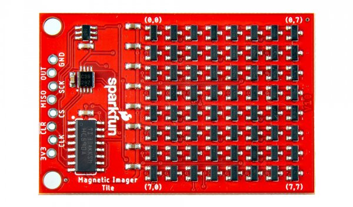</a></td>
     <td style="text-align: center; vertical-align: middle; border: solid 1px #cccccc;"><a href="../assets/img/26943_Magnetic_Imaging_Tile_Bottom.jpg">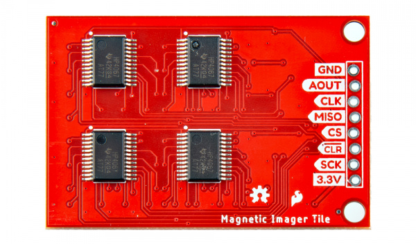</a></td>
    </tr>
    <tr style="vertical-align:middle;">
     <td style="text-align: center; vertical-align: middle; border: solid 1px #cccccc;"><i>Top View</i></td>
     <td style="text-align: center; vertical-align: middle; border: solid 1px #cccccc;"><i>Bottom View</i></td>
    </tr>
  </table>

!!! note
    SparkX re-designed version 3.0's PCB for DFM and simplified some of the platform interfacing code. This design was transferred to SparkFun red and labeled as v1.0. Besides the color of the PCB and a few minor silkscreen changes, the boards are functionally the same.

    The major advancement of the current design (SparkX v3.0, SparkFun v1.0) is a dramatic increase in the speed with which the tile data can be read out. ~2000 frames per second (fps) can be achieved which allows visualizing even quickly varying fields (e.g. those in a 60Hz transformer, or a moving motor). Version 3.0 reduces the size of the tile to an 8x8 grid of hall effect sensors (64 total), arrayed in a 4mm grid. The boards is tile-able with up to 4 of the boards tile-able with minimal borders to create a 16x16 array.

!!! tip "What's with the zig zagging PTH's?"
    You may be wondering what is going on with the PTH. For those that have been around for a while, you might have noticed PTHs zig zagging on previous board designs. These offset PTHs are meant to "lock" header pins to the board to aid in soldering. For more information on the locking PTHs, check out the [Pete's "Sneaky Footprints"](https://www.sparkfun.com/tutorials/114)!

### Power

The 3.3V and ground are broken out on the edge of the board.

* **3V3** / **3.3V** &mdash; The 3.3V net is labeled as 3V3 or 3.3V. You can apply power to the board if you have a regulated voltage of 3.3V. Otherwise, you could power a separate device through the 3V3 PTH pin.
    * While the pin is labeled as 3.3V, you can also safely power the board with 5V as well. The components on the board can handle the voltage.
* **GND** &mdash; Of course, is the common, ground voltage (0V reference) for the system.

  <table>
    <tr style="vertical-align:middle;">
     <td style="text-align: center; vertical-align: middle; border: solid 1px #cccccc;"><a href="../assets/img/26943_Magnetic_Imaging_Tile_Top_Power.jpg">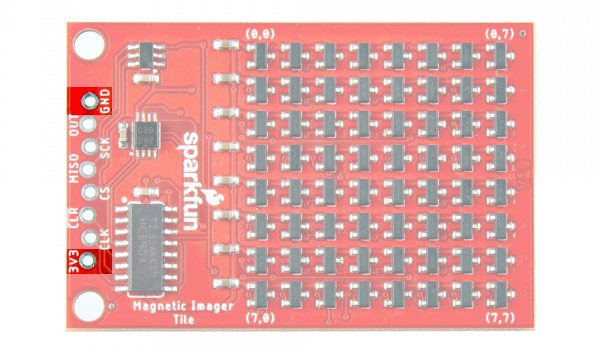</a></td>
     <td style="text-align: center; vertical-align: middle; border: solid 1px #cccccc;"><a href="../assets/img/26943_Magnetic_Imaging_Tile_Bottom_Power.jpg">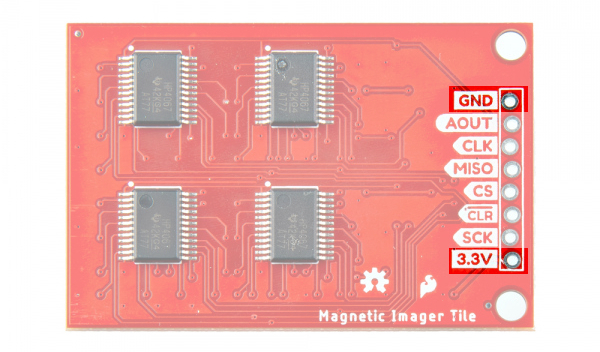</a></td>
    </tr>
    <tr style="vertical-align:middle;">
     <td style="text-align: center; vertical-align: middle; border: solid 1px #cccccc;" colspan="2"><i>Power and Ground Highlighted (Top & Bottom View)</i></td>
    </tr>
  </table>

### Hall Effect Sensors

The Magnetic Imaging Tile consists of 64x analog hall effect sensors arranged in an 8x8 grid. The specific hall effect sensor used is DRV5053VA with a sensitivity of -90mV/mT. The coordinates of each sensor is indicated by the silkscreen by the corners of the 8x8 array of hall effect sensors.

  <table>
    <tr style="vertical-align:middle;">
     <td style="text-align: center; vertical-align: middle; border: solid 1px #cccccc;"><a href="../assets/img/26943_Magnetic_Imaging_Tile_front_hall_effect_sensors.jpg">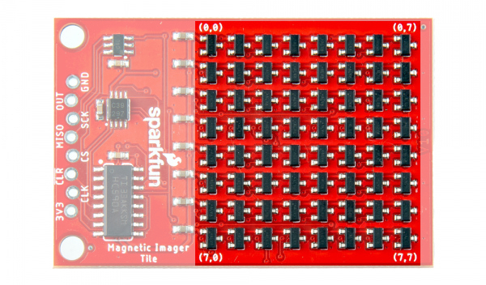</a></td>
    </tr>
    <tr style="vertical-align:middle;">
     <td style="text-align: center; vertical-align: middle; border: solid 1px #cccccc;"><i>Hall Effect sensors Highlighted/i></td>
    </tr>
  </table>

### Counter, Decoder, Muxes, and ADC

The circuit includes an SN74HC590A 8-bit binary counter (the 14-pin IC on the top of the board), SN74LVC1G139 decoder (the 8-pin IC on the top of the board), four CD74HC4067 multiplexors (the 4x ICs on the back of the board), and the AD7680 16-bit ADC (the 6-pin IC on the top of the board). Together (with some code loaded on a microcontroller), the components output the analog readings from the 64x hall effect sensors through SPI.

  <table>
    <tr style="vertical-align:middle;">
     <td style="text-align: center; vertical-align: middle; border: solid 1px #cccccc;"><a href="../assets/img/26943_Magnetic_Imaging_Tile_back_mux.jpg">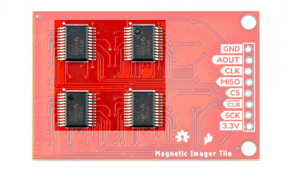</a></td>
     <td style="text-align: center; vertical-align: middle; border: solid 1px #cccccc;"><a href="../assets/img/26943_Magnetic_Imaging_Tile_front_decoder_counter_adc.jpg">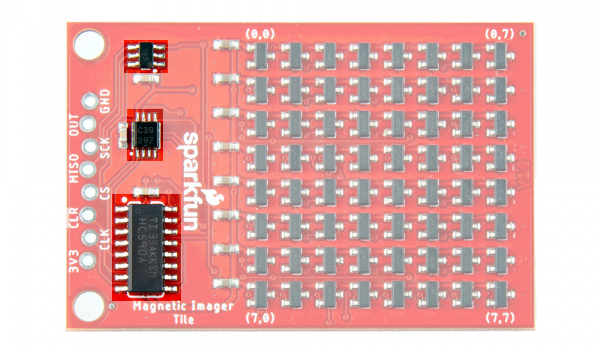</a></td>
    </tr>
    <tr style="vertical-align:middle;">
     <td style="text-align: center; vertical-align: middle; border: solid 1px #cccccc;"><i>Counter, Decoder, ADC Top View</i></td>
     <td style="text-align: center; vertical-align: middle; border: solid 1px #cccccc;"><i>Mux Bottom View</i></td>
    </tr>
  </table>

With a 16-bit ADC and a 3.3V range, this is approximately 50mV per bit. The Magnetic Imaging Tile is able to detect roughly +/- 0.5mT per bit. For our demo in the GIF we used a RedBoard Turbo with the SAMD21 to clock out the ADC data to the serial port at 115200. The serial is then parsed by a Processing sketch. This setup can achieve over 76 frames per second. With buffering the setup is capable of 200 fps. The ChipKit MAX32 is also supported and can achieve around 2,000fps. A faster processor should be able to achieve 1500fps (the 100kSPS limit of the ADC). The raw analog signal is also exposed. This allows processors that have built-in faster ADC to convert the signal directly. The theoretical limit of the DRV5053 is around 20,000 fps but would require a very fast ADC.

### SPI

The [SPI](https://learn.sparkfun.com/tutorials/serial-peripheral-interface-spi/all) port is broken out on the edge of the board. This connects to the AD7680 adc.

* **MISO** &mdash; Peripheral out, central in. The conversion from the AD7680 is provided on this output data pin.
* **CLK** (top side) / **SCK** (bottom side) &mdash; Serial clock input.
* <b>CS</b> &mdash; Chip select. This is active when pulled low.

  <table>
    <tr style="vertical-align:middle;">
     <td style="text-align: center; vertical-align: middle; border: solid 1px #cccccc;"><a href="../assets/img/26943_Magnetic_Imaging_Tile_Top_SPI.jpg">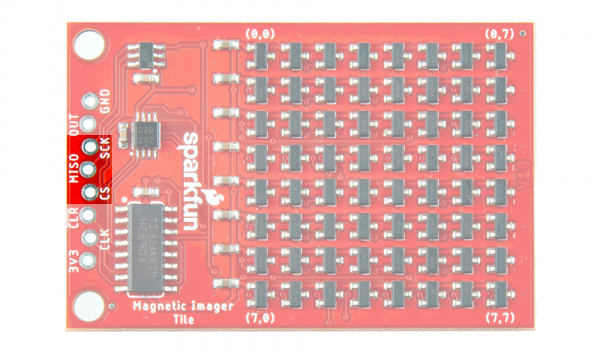</a></td>
     <td style="text-align: center; vertical-align: middle; border: solid 1px #cccccc;"><a href="../assets/img/26943_Magnetic_Imaging_Tile_Bottom_SPI.jpg">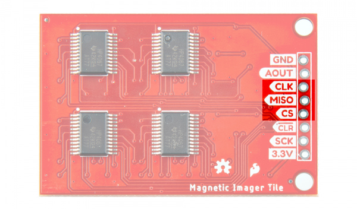</a></td>
    </tr>
    <tr style="vertical-align:middle;">
     <td style="text-align: center; vertical-align: middle; border: solid 1px #cccccc;" colspan="2"><i>SPI Pins Highlighted (Top & Bottom View)</i></td>
  </table>

!!! note
    On the top side of the board, the serial clock is labeled as SCK. On the bottom side of the board, the serial clock in is labeled as CLK. Make sure to connect the serial clock located between the analog out and MISO pins.

### Additional Pins Broken Out

The following pins are also broken out on the board.

* <b>CLR</b> &mdash; Clear counter input pin. This is connected to the SN74HC590AN.
* **CLK** (Top side) / **SCK** (bottom side) &mdash; Counter clock input. This is connected to the SN74HC590AN.
* **OUT** or **AOUT** &mdash; This is connected to the AD7680's analog input. This is connected to the multiplexors as well.

  <table>
    <tr style="vertical-align:middle;">
     <td style="text-align: center; vertical-align: middle; border: solid 1px #cccccc;"><a href="../assets/img/26943_Magnetic_Imaging_Tile_Top_Other_Pins.jpg">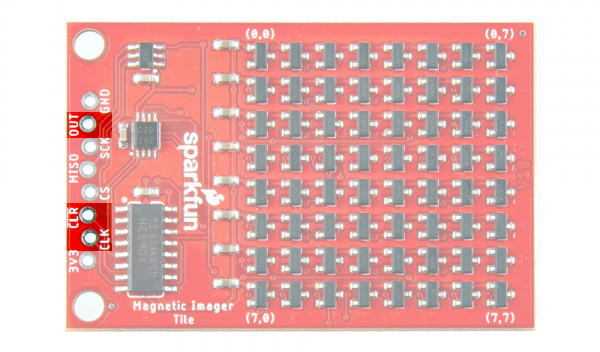</a></td>
     <td style="text-align: center; vertical-align: middle; border: solid 1px #cccccc;"><a href="../assets/img/26943_Magnetic_Imaging_Tile_Bottom_Other_Pins.jpg">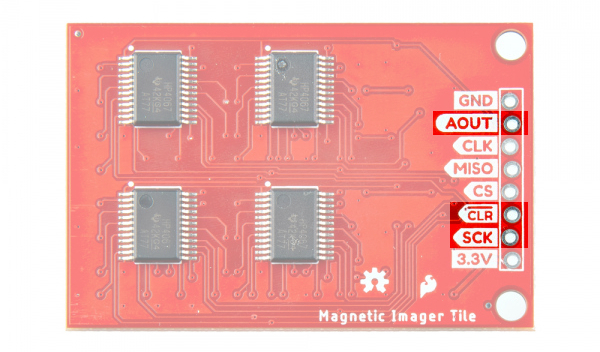</a></td>
    </tr>
    <tr style="vertical-align:middle;">
     <td style="text-align: center; vertical-align: middle; border: solid 1px #cccccc;" colspan="2"><i>Additional Pins Broken Out Highlighted (Top & Bottom View)</i></td>
  </table>

!!! note
    On the top side of the board, the counter clock pin is labeled as CLK. On the bottom side of the board, the  counter clock in is labeled as SCK. Make sure to connect to the counter clock pin between the counter clear and 3.3V pin.

### Board Dimensions

The board is 1.35" x 2.05" (34.29mm x 52.07mm). There are 2x mounting holes by the PTHs. You can use 4-40 standoffs to mount the board to a panel or enclosure.

  <table>
    <tr style="vertical-align:middle;">
     <td style="text-align: center; vertical-align: middle; border: solid 1px #cccccc;"><a href="../assets/img/SparkFun_Magnetic_Imaging_Tile_Board_Dimensions.png">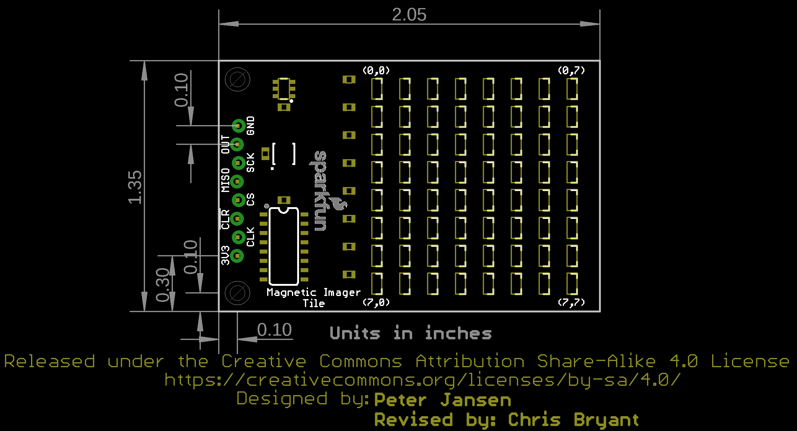</a></td>
    </tr>
    <tr style="vertical-align:middle;">
     <td style="text-align: center; vertical-align: middle; border: solid 1px #cccccc;"><i>Board Dimensions</i></td>
    </tr>
  </table>

