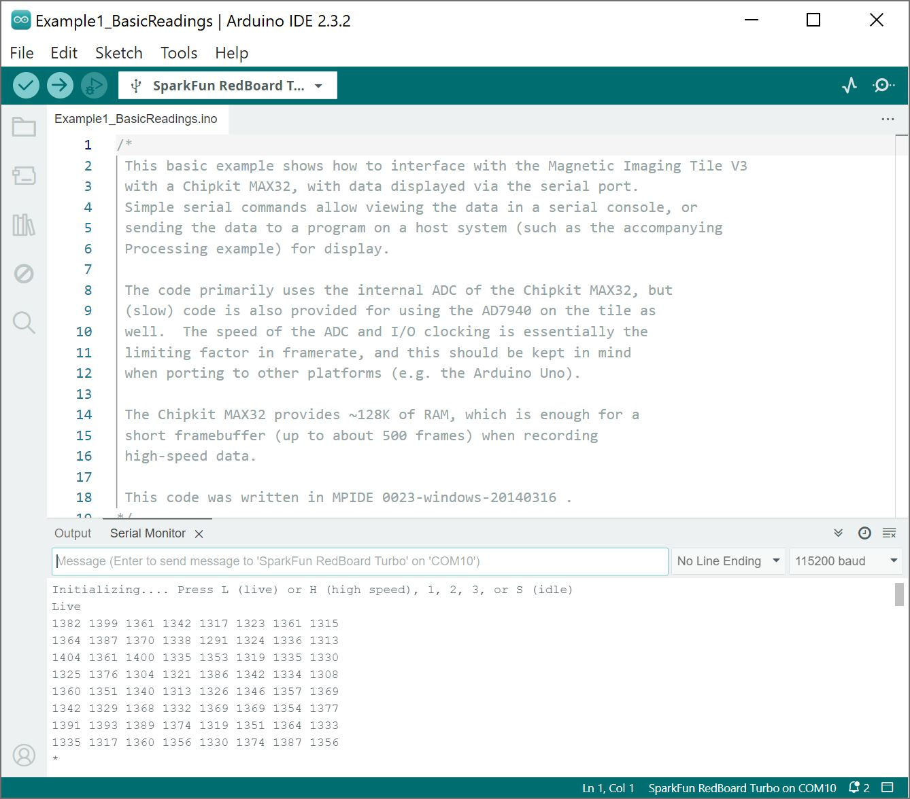
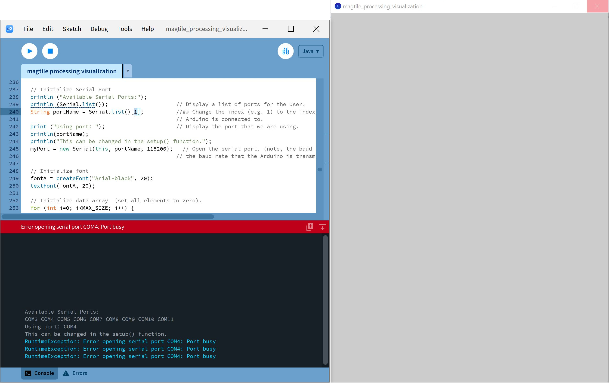
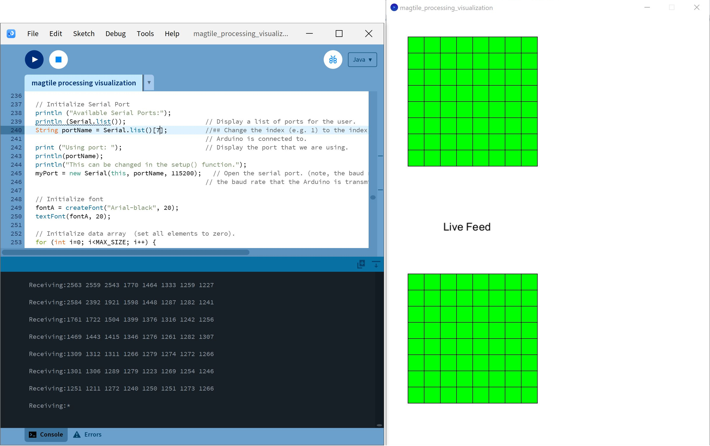
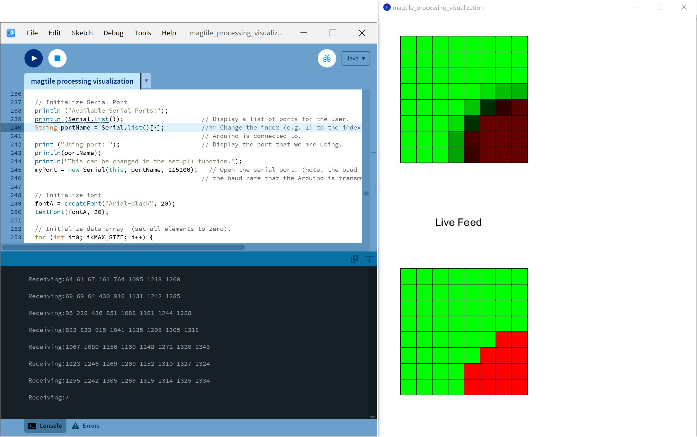
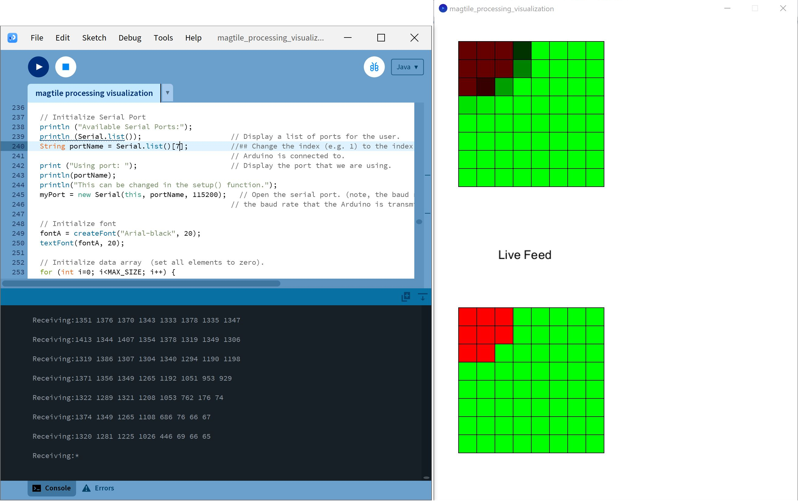
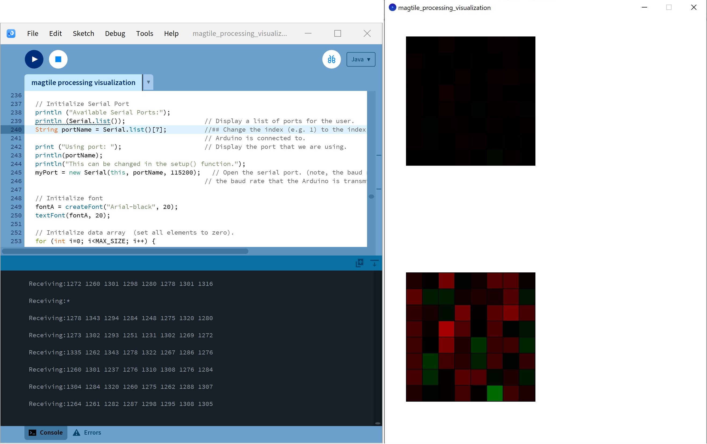
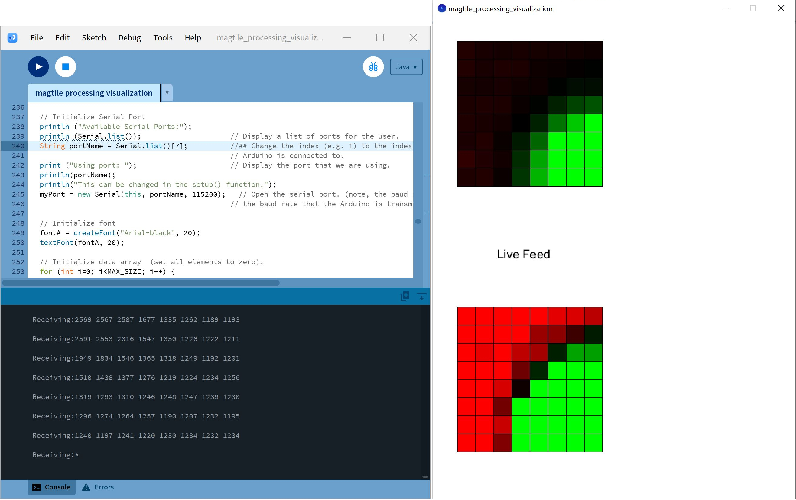
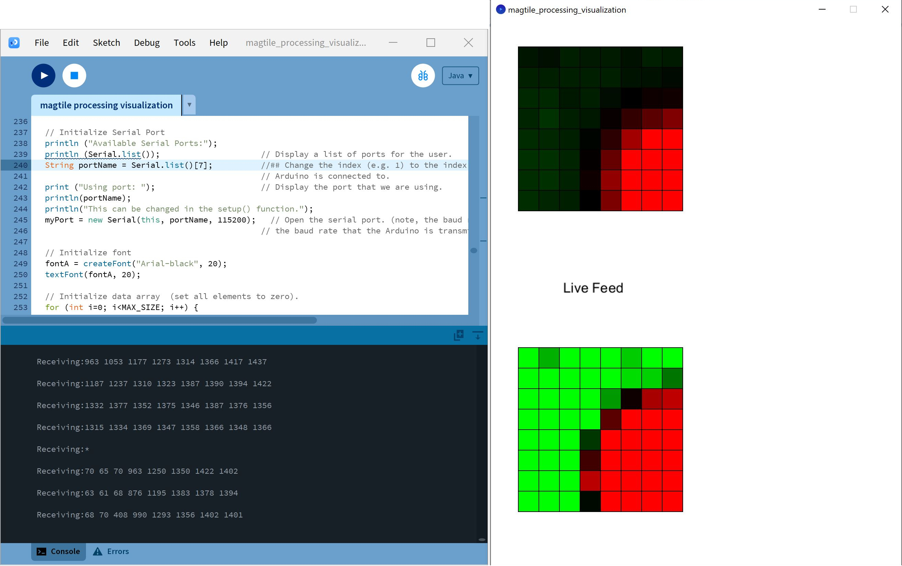
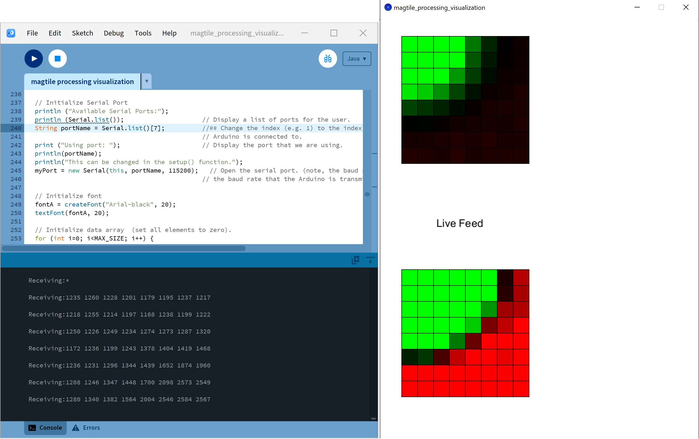
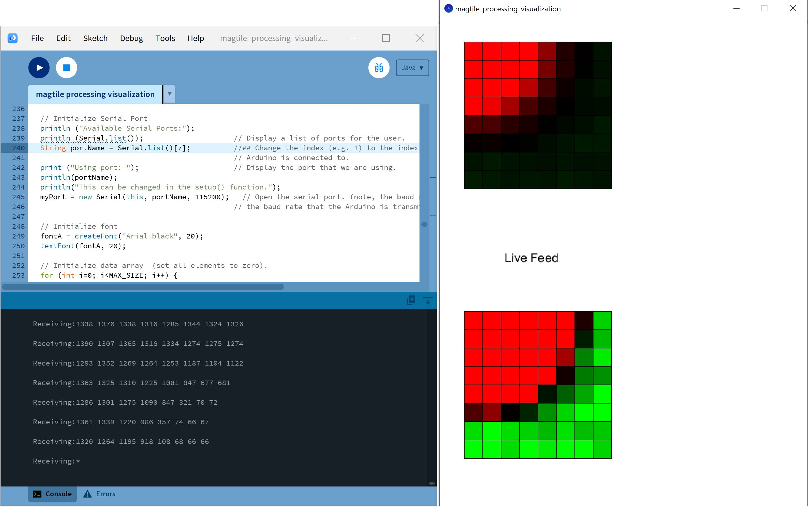

This example also is located in the Magnetic Imaging Tile's Hardware Repo. To grab it, go ahead and download or clone the [SparkFun Magnetic Imaging Tile hardware repo](https://github.com/sparkfun/SparkFun_Magnetic_Imaging_Tile/) if you have not already.

<div style="text-align: center"><a href="https://github.com/sparkfun/SparkFun_Magnetic_Imaging_Tile/archive/refs/heads/main.zip" target="download_magnetic_Imaging_tile_hardware_repo" class="md-button">Download Magnetic Imaging Tile Hardware Repo (ZIP)</a></div>


### Upload Arduino Example

Processing listens for serial data, so we'll need to get our microcontroller to produce serial data that makes sense to Processing. In this case, we will be using the [Arduino example to output basic readings from earlier](../arduino_example/).

<div style="text-align: center;">
  <table>
    <tr style="vertical-align:middle;">
     <td style="text-align: center; vertical-align: middle; border: solid 1px #cccccc;"><a href="../assets/img/Arduino_Turbo_SAMD21_Magnetic_Imaging_Tile_Output.JPG"></a></td>
    </tr>
    <tr style="vertical-align:middle;">
     <td style="text-align: center; vertical-align: middle; border: solid 1px #cccccc;"><i>Arduino IDE with Output</i></td>
    </tr>
  </table>
</div>

!!! note
    There is also an example for Diligent's chipKIT Max32! For users that are interested in using the board, the example code is in the **chipkit** folder.


### Run the "MagTile Processing Visualization" Processing Example

Once this sketch is uploaded and a mode has been selected, we need to tell Processing how to turn this data into a visualization. The Processing sketch to do this is located one folder above the Arduino sketch: ... **SparkFun_Magnetic_Imaging_Tile** > **Software** > **Processing** > **magtile_processing_visualization** > **magtile_processing_visualization.pde**. Open the **magtile_processing_visualization.pde** file in Processing.

You can also copy and paste the following code in the Processing IDE as well.

``` c++
// Magnetic Imager Tile v3 Processing Visualization
// This code is intended to pair with the Arduino/Chipkit code for reading data
// from the magnetic imager tile v3, and streaming it through a Serial port.
//
// Two 8x8 grids are shown: a normal gain (top) and high-gain (bottom).  The
// high-gain is particularly useful for low-intensity fields.
//
// Keys (lower-case):
//   L  - Live mode.  Press this to start streaming data live from the tile.
//  1-4 - High-speed capture.  Capture a number of high-speed frames (set in
//        the Chipkit code) from the tile, and stream them back.  Note that
//        the actual framerate will depend upon the code/platform/ADC.  The
//        values displayed here (1 ~= ~2000Hz, 4 ~= 250Hz) are calibrated
//        from my Chipkit MAX32 platform, and may vary quite a bit if you're
//        using a different platform or code.
//   C  - When in LIVE mode, it's possible to press 'C' and calibrate out
//        the background level for each tile, to reduce the noise.  If you
//        do this, ensure that no fields are present on the tile.  
//        Alternatively: If a static field is present on the tile, this
//        will help show changes to that static field.
//
// Serial port: The serial port index is hard-coded in, and you will likel
//  have to change this for your platform.  See the //## comment marker in
//  the setup() function.
//


import processing.serial.*;

// Serial port vairables.
Serial myPort;  // Create object from Serial class
int val;        // Temporary variable storing data received from the serial port

// Array of x/y coordinates recieved over serial port.  Maximum number of recordings to store is MAX_RECORDINGS.
int MAX_SIZE = 8;
int[][] data = new int[MAX_SIZE][MAX_SIZE];
int curDataIdx = 0;      // Index of array element that has highest populated value (-1)

// Font (for drawing text)
PFont fontA;

// Screenshot index (for taking screenshots).
int screenshot_number = 0;

int numCalibFrames = 0;
int maxCalibFrames = 200;
int calibrationEnabled = 0;
int[][] dataCalib = new int[MAX_SIZE][MAX_SIZE];
int isCalibrated = 0;

String curText = "text";


// Called whenever there is serial data available to read
void serialEvent(Serial port) {
  // Data from the Serial port is read in serialEvent() using the readStringUntil() function with * as the end character.
  String input = port.readStringUntil(char(10));

  if (input != null) {
    // Helpful debug message: Uncomment to print message received   
    println( "Receiving:" + input);
    input = input.trim();    
    int split_point = input.indexOf(' ');
    if (split_point <= 0) {
      curDataIdx = 0;
      return;        // If data does not contain a comma, then disregard it.
    } else {
      // Parse data
      // The data is split into an array of Strings with a comma or asterisk as a delimiter and converted into an array of integers.
      float[] vals = float(splitTokens(input, " "));      
      if (vals.length != MAX_SIZE) return;

      // Store data      
      for (int i=0; i<MAX_SIZE; i++) {
        data[curDataIdx][i] = int(vals[i]);

        if (calibrationEnabled == 1) {
          dataCalib[curDataIdx][i] += int(vals[i]);                    
        }
      }

      // Increment index that we store new data at.      
      curDataIdx += 1;
      if (curDataIdx >= MAX_SIZE) {
        curDataIdx = 0;

        if (calibrationEnabled == 1) {
          numCalibFrames += 1;

          if (numCalibFrames > maxCalibFrames) {
            calibrationEnabled = 0;
            calibration();
          }
        }
      }

      // Helpful debug message: Display serial data after parsing.
      //println ("Parsed x:" + x + "  y:" + y);
    }
  }

  /*
      // Mask
    for (int i=0; i<12; i++) {
      for (int j=0; j<12; j++) {
        if ((i >= 2) && (i<= 7) && (j >= 2) && (j <= 9)) {
          if (j == 9) {
            data[i][j] = 400 - data[i][j];
          }
          // keep existing data
        } else {
          data[i][j] = 200;
        }
      }
    }
  */

}


void calibration() {

  println("Calibration Data:");
  for (int i=0; i<MAX_SIZE; i++) {
    for (int j=0; j<MAX_SIZE; j++) {
      dataCalib[i][j] = floor((float)dataCalib[i][j] / (float)maxCalibFrames);
      print (dataCalib[i][j] + "  ");      
    }
    println("");
  }

  isCalibrated = 1;
  curText = "";


}

// Draws a shape at each x/y location sent over the serial port.
// Only draws the last N locations, where N is equal to MAX_RECORDINGS (i.e. the size of the data array).
void draw_stored_data() {
    int pixelsize = 30;                // Size of shape to draw

    int offset_x = 10;
    int offset_y = 10;

    float MAX_VALUE_CALIB = 330.0f;  // Chipkit internal ADC
    float MAX_VALUE = 660.0f;        // Chipkit internal ADC

    //float MAX_VALUE = 400.0f;  // internal ADC
    //float MAX_VALUE = 7000.0f; // 14-bit external ADC


    for (int i=0; i<MAX_SIZE; i++) {
      for (int j=0; j<MAX_SIZE; j++) {
        int y = (MAX_SIZE-i) * pixelsize;
        int x = (MAX_SIZE-j) * pixelsize;

        if (isCalibrated == 1) {        
          //float value = (float)data[i][j] / MAX_VALUE;
          float value = ((float)data[i][j] - (float)dataCalib[i][j])/ MAX_VALUE;

          //float intensity = int(floor(255 * abs(value - 0.50f)));
          float intensity = int(255 * value);
          if (value < 0.0) {
            fill(-intensity, 0, 0);
            //stroke(value);
          } else {
            fill(0, intensity, 0);
            //stroke(value);
          }

        } else {
          float value = (float)data[i][j] / MAX_VALUE;          

          float intensity = int(floor(255 * abs(value - 0.50f)));
          if (value < 0.50) {
            fill(intensity, 0, 0);
            //stroke(value);
          } else {
            fill(0, intensity, 0);
            //stroke(value);
          }


        }
        rect(x + offset_x, y + offset_y, pixelsize, pixelsize);
      }
    }

    // Higher sensitivity
    offset_y = 450;
    for (int i=0; i<MAX_SIZE; i++) {
      for (int j=0; j<MAX_SIZE; j++) {
        int y = (MAX_SIZE-i) * pixelsize;
        int x = (MAX_SIZE-j) * pixelsize;

        if (isCalibrated == 1) {               
          float value = ((float)data[i][j] - (float)dataCalib[i][j])/ MAX_VALUE;

          float intensity = int(3000 * value);

          if (value < 0.0) {
            fill(-intensity, 0, 0);
            //stroke(value);
          } else {
            fill(0, intensity, 0);
            //stroke(value);
          }

        } else {
        float value = (float)data[i][j] / MAX_VALUE;                

        float intensity = int(floor(3000 * abs(value - 0.50f)));        

        if (value < 0.50) {
          fill(intensity, 0, 0);
          //stroke(value);
        } else {
          fill(0, intensity, 0);
          //stroke(value);
        }

        }
        rect(x + offset_x, y + offset_y, pixelsize, pixelsize);
      }
    }

}


// This function runs a single time after the program beings.
void setup() {
  size(600, 800);                    // Window size
  //colorMode(HSB, 255, 255, 255);     // Colour space

  // Initialize Serial Port
  println ("Available Serial Ports:");
  println (Serial.list());                     // Display a list of ports for the user.  
  String portName = Serial.list()[1];          //## Change the index (e.g. 1) to the index of the serial port that the
                                               // Arduino is connected to.
  print ("Using port: ");                      // Display the port that we are using.
  println(portName);
  println("This can be changed in the setup() function.");
  myPort = new Serial(this, portName, 115200);   // Open the serial port. (note, the baud rate (e.g. 9600) must match
                                               // the baud rate that the Arduino is transmitting at).

  // Initialize font
  fontA = createFont("Arial-black", 20);
  textFont(fontA, 20);

  // Initialize data array  (set all elements to zero).
  for (int i=0; i<MAX_SIZE; i++) {
    for (int j=0; j<MAX_SIZE; j++) {
      data[i][j] = 250;
    }
  }  

  // Send command


}


// This function runs repeatedly, like the loop() function in the Arduino language.
void draw() {

  background(255, 255, 255);             // Set background to white

  // At each iteration, draw the data currently specified in the 'data' array to the screen.    
  draw_stored_data();

  // Note: Serial data is updated in the background using the serialEvent() function above, so we don't
  // have to explicitly look for it (or parse it here).

  textAlign(CENTER);
  fill(0);
  text(curText, 150, 400);

}


// This is another interrupt function that runs whenever a key is pressed.
// Here, as an example, if the space key (' ') is pressed, then the program will save a screenshot.
// If the 'a' key is pressed, then the program will clear the data history.
void keyPressed() {
  // Press <space>: Save screenshot to file.
  if (key == ' ') {
   saveFrame("screenshot-" + screenshot_number + ".png");
   screenshot_number += 1;
  }

  // Press 'a': Clear data array
  if (key == 'a') {  
    for (int i=0; i<MAX_SIZE; i++) {
      for (int j=0; j<MAX_SIZE; j++) {
        data[i][j] = 0;
      }
    }  
    curDataIdx = 0;
  }  

  if (key == 'l') {
    myPort.write('L');
    myPort.write('\n');
    curText = "Live Feed";
  }
  if (key == 'h') {
    myPort.write('H');
    myPort.write('\n');    
  }
  if (key == 's') {
    myPort.write('S');
    myPort.write('\n');
    curText = "Idle";
  }

  if (key == '1') {
    myPort.write('1');
    myPort.write('\n');
    curText = "2000Hz capture";
  }
  if (key == '2') {
    myPort.write('2');
    myPort.write('\n');
    curText = "1000Hz capture";
  }
  if (key == '3') {
    myPort.write('3');
    myPort.write('\n');
    curText = "500Hz capture";
  }
  if (key == '4') {
    myPort.write('4');
    myPort.write('\n');
    curText = "250Hz capture";    
  }

  if (key == 'c') {
    for (int i=0; i<MAX_SIZE; i++) {
      for (int j=0; j<MAX_SIZE; j++) {
        dataCalib[i][j] = 0;      
      }
    }
    numCalibFrames = 0;
    calibrationEnabled = 1;
    curText = "Calibrating";
  }

  if (key == 'd') {
    println("Calibration Data:");
    for (int i=0; i<MAX_SIZE; i++) {
      for (int j=0; j<MAX_SIZE; j++) {      
        print (dataCalib[i][j] + "  ");      
      }
      println("");
    }
  }

}
```

Attempting to run the Processing sketch will show us available serial ports in the debug window from this line of code, where `portName` is defined as a string:

```bash
myPort = new Serial(this, portName, 115200);
```

Identify which serial port your Arduino is on. For instance, my SparkFun RedBoard Turbo is on COM10, which corresponds to the 8th element in the array as `[7]`. So I will need to change `1` to `7` where `portName` is defined to ensure that Processing is listening to the correct serial port.

<div style="text-align: center;">
  <table>
    <tr style="vertical-align:middle;">
     <td style="text-align: center; vertical-align: middle; border: solid 1px #cccccc;"><a href="../assets/img/Processing_COM_Port_Select.JPG"></a></td>
    </tr>
    <tr style="vertical-align:middle;">
     <td style="text-align: center; vertical-align: middle; border: solid 1px #cccccc;"><i>Adjusting Processing Example's Serial Port</i></td>
    </tr>   
  </table>
</div>

Once we've done this, we should be able to run the Processing sketch and it will give us a nice visualization of the magnetic fields in range of the Magnetic Imaging Tile. Send a character to set the mode. By sending a lower case <kbd>l</kbd> in the window with the visualization will set it to live mode and begin streaming data live from the tile. As explained in the example code, the top 8x8 grid will display the normal gain. The bottom 8x8 grid will display a high gain. Place a magnet near the array of hall effect sensors. In this case, a magnet was placed over (0,0) as shown in the Processing Console's serial output. The grid in this case did not show any changes.

<div style="text-align: center;">
  <table>
    <tr style="vertical-align:middle;">
     <td style="text-align: center; vertical-align: middle; border: solid 1px #cccccc;"><a href="../assets/img/Processing_0x_0y.JPG"></a></td>
    </tr>
    <tr style="vertical-align:middle;">
     <td style="text-align: center; vertical-align: middle; border: solid 1px #cccccc;"><i>Processing Output, Magnet Over (0,0)</i></td>
    </tr>   
  </table>
</div>

Rotating the magnet to the other pole and place it over (0,0) again. In this case, the change was more apparent as we are able to view the magnetic fields in red. If you know the polarity of the magnet as explained earlier in the Arduino example, you will notice that the squares that have a red color are lower in magnitude whenever the magnet's north pole is placed over the hall effect sensor.

<div style="text-align: center;">
  <table>
    <tr style="vertical-align:middle;">
     <td style="text-align: center; vertical-align: middle; border: solid 1px #cccccc;"><a href="../assets/img/Processing_0x_0y_North.JPG"></a></td>
    </tr>
    <tr style="vertical-align:middle;">
     <td style="text-align: center; vertical-align: middle; border: solid 1px #cccccc;"><i>Processing Output, Magnet North Over (0,0)</i></td>
    </tr>   
  </table>
</div>

Rotating the magnet back to the other pole and place it to a different position near the array of hall effect sensors. In this case, the magnet was placed around (7,7) and did not show as much of a change in the 8x8 grid.

<div style="text-align: center;">
  <table>
    <tr style="vertical-align:middle;">
     <td style="text-align: center; vertical-align: middle; border: solid 1px #cccccc;"><a href="../assets/img/Processing_7x_7y.JPG"></a></td>
    </tr>
    <tr style="vertical-align:middle;">
     <td style="text-align: center; vertical-align: middle; border: solid 1px #cccccc;"><i>Processing Output, Magnet Over (7,7)</i></td>
    </tr>   
  </table>
</div>

Rotate the magnet to the other pole and place it around (7,7). In this case, we are able to view the magnetic fields in red again.

<div style="text-align: center;">
  <table>
    <tr style="vertical-align:middle;">
     <td style="text-align: center; vertical-align: middle; border: solid 1px #cccccc;"><a href="../assets/img/Processing_7x_7y_North.JPG"></a></td>
    </tr>
    <tr style="vertical-align:middle;">
     <td style="text-align: center; vertical-align: middle; border: solid 1px #cccccc;"><i>Processing Output, Magnet North Over (7,7)</i></td>
    </tr>   
  </table>
</div>

When in live mode, it's also possible to calibrate out the background level for each tile to reduce the noise in the Processing example. Send a lower case <kbd>c</kbd> in the window with the visualization. When calibrating, ensure that there are no magnetic fields present around the tile. After a few seconds, the visualization will show a different color in the 8x8 grid.

<div style="text-align: center;">
  <table>
    <tr style="vertical-align:middle;">
     <td style="text-align: center; vertical-align: middle; border: solid 1px #cccccc;"><a href="../assets/img/Processing_Calibrated.JPG"></a></td>
    </tr>
    <tr style="vertical-align:middle;">
     <td style="text-align: center; vertical-align: middle; border: solid 1px #cccccc;"><i>Processing Output, Calibrated</i></td>
    </tr>   
  </table>
</div>

Place a magnet over (0,0). In this case, the change was apparent with both sides of the magnet where the magnet's south pole was shown with green and the magnet's north pole was shown with red.

<div style="text-align: center;">
  <table>
    <tr style="vertical-align:middle;">
     <td style="text-align: center; vertical-align: middle; border: solid 1px #cccccc;"><a href="../assets/img/Processing_0x_0y_Calibrated.JPG"></a></td>
     <td style="text-align: center; vertical-align: middle; border: solid 1px #cccccc;"><a href="../assets/img/Processing_0x_0y_North_Calibrated.JPG"></a></td>
    </tr>
    <tr style="vertical-align:middle;">
     <td style="text-align: center; vertical-align: middle; border: solid 1px #cccccc;"><i>Processing Output, Calibrated with Magnet Over (0,0)</i></td>
     <td style="text-align: center; vertical-align: middle; border: solid 1px #cccccc;"><i>Processing Output, Calibrated with Magnet North Over (0,0)</i></td>
    </tr>   
  </table>
</div>

Place the magnet over (7,7). You should see something similar like the images below. The color of the magnetic field in the grid will depend on the orientation of the magnet.

<div style="text-align: center;">
  <table>
    <tr style="vertical-align:middle;">
     <td style="text-align: center; vertical-align: middle; border: solid 1px #cccccc;"><a href="../assets/img/Processing_7x_7y_Calibrated.JPG"></a></td>
     <td style="text-align: center; vertical-align: middle; border: solid 1px #cccccc;"><a href="../assets/img/Processing_7x_7y_North_Calibrated.JPG"></a></td>
    </tr>
    <tr style="vertical-align:middle;">
     <td style="text-align: center; vertical-align: middle; border: solid 1px #cccccc;"><i>Processing Output, Calibrated with Magnet Over (7,7)</i></td>
     <td style="text-align: center; vertical-align: middle; border: solid 1px #cccccc;"><i>Processing Output, Calibrated with Magnet North Over (7,7)</i></td>
    </tr>   
  </table>
</div>

Now that we can see the magnetic fields from a magnet, try grabbing an object nearby to see if you can view any magnetic fields!

<div style="text-align: center;">
  <table>
    <tr style="vertical-align:middle;">
     <td style="text-align: center; vertical-align: middle; border: solid 1px #cccccc;"><a href="../assets/img/26943_Magnetic_Imaging_Tile_Hall_Effect_Sensors_Neodymium_Magnets_Action.gif"></a></td>
     <td style="text-align: center; vertical-align: middle; border: solid 1px #cccccc;"><a href="../assets/img/26943_Magnetic_Imaging_Tile_Hall_Effect_Sensors_Magnets_FanAction.gif"></a></td>
    </tr>
    <tr style="vertical-align:middle;">
     <td style="text-align: center; vertical-align: middle; border: solid 1px #cccccc;"><i>Processing Output with a Magnet Moving<br />over the Magnetic Imaging Tile</i></td>
     <td style="text-align: center; vertical-align: middle; border: solid 1px #cccccc;"><i>Processing Output with a Fan Rotating<br />over the Magnetic Imaging Tile</i></td>
    </tr>   
  </table>
</div>
